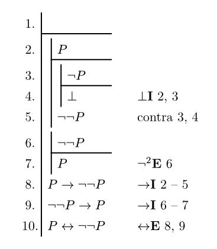
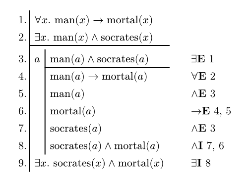

# Go Fitch

This is a Typst package to typeset [Fitch-style](https://en.wikipedia.org/wiki/Fitch_notation) natural deduction proofs.




## Usage

```typst
#import "@preview/go-fitch:0.1.0": *

#fitch(
  premises: (
    [you need at least one premise],
    [but you can have more],
    (<prem3>, [they are ordinary propositions], [but cannot contain sub-proofs]),
  ),
  (<here>, [this is a fully written proof step], [with an explanation]),
  ([they can be written without a label], [but a label helps you reference things like @here]),
  (<there>, [or you can omit an explanation]),
  [or both!],
  assume(
    premise: [this argument is short for a single-item premises],
    [the top-level proof is written in `fitch`],
    [sub-proofs are contained in an `assume`],
    assume(
      premise: [],
      [sub-proofs can nest]
    )
  ),
  assume(
    beside: [$a$],
    premise: [items can be set to the side if the turnstile],
    [this could be for variable introduction, as here],
    [or it could be for modal operators],
  ),
)

```
